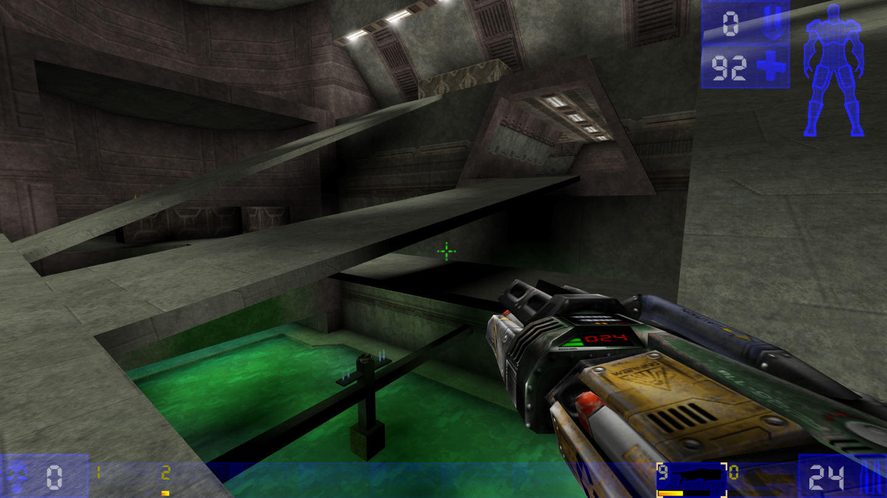
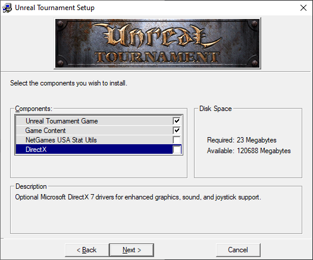

# UT99 in 2020


Getting UT99 to run in 2020 is not a particularly huge issue but there are
compatibility issues, version mismatch issues in netplay and a confusing amount
of all-in-one packs/patches circulating around.

Ontop of that different sources of UT99 come in different forms that can cause
interplay issues.

The goal of this guide is to get UT99 running without compatibility issues on
modern systems as close to the original as possible, in the simplest, most
minimal form.

**!IMPORTANT!** This guide comes with a short [companion script](dl/ut99-in-2020-check.bat)
that you can drop into the root of your UT99 installation and run, it will not
modify your installation but instead check it for issues that are the subject of
this guide and point you back to the guide about how to fix them. If you don't
care about reading this guide in full, you can just run and follow the script
until it reports no warnings/errors.

The script is a simple, well-documented batch file that even without much prior
knowledge can be easily verified as safe to run and will run on practically
every Windows version.

## Basic Installation
Different sources of UT99 differ in significant ways from each other, our
first goal is to get a practically equivalent installation no matter where we
get UT99 from.

Our target goal is a *clean* UT99 GOTY installation with the latest official
patch (v436) and the exact same game contents.

At the time of this guide 3 different sources are known described below.

### GOTY Disc Version
If you own the disc version you will own 1-2 discs.

**!IMPORTANT!** In case you own 2 discs, it is vital that you do **not** install
the 2nd disc, it contains now 2 outdated versions of mods
([ChaosUT](https://chaoticdreams.org/chaosut/) and
[RocketArena](https://www.moddb.com/mods/rocket-arenaut)), which you can grab in
newer versions from their respective sources if you care about them, as well as
the S3TC Texture Pack that causes significant issues in netplay.

Using the 2nd disc has been discouraged by the developers themselves and neither
the later released GOG Version nor the Steam Version therefore contain its
contents.

Instead, insert the 1st disc and run the `Setup.exe` contained therein.
The Installation process is largely self-describing until you reach the step
where it will ask you what Components to install.



In this step make sure to **uncheck** both the `NetGames USA Stat Utils` and
`DirectX` components.

The NetGames component was an online service that received gameplay stats from
your client, it is not defunct and neither the GOG nor Steam Version ships with
it.

The DirectX component is a DirectX 7 driver that you won't need on modern
systems, especially because we will exchange the shipped DirectX ut99 video driver
with a more modern version to fix compatibility issues.

From there on continue the installation until it succeeds.

Once installed update the installation to the latest official version 436, [see
here](#installing-the-latest-official-patch-436).

### GOTY GOG Version
The GOG Version at the time of this guide already comes with a clean 436
installation that we can use as a basis.

Please [continue here](#community-compatibility-fixes).

### GOTY Steam Version
The Steam Version at the time of this guide claims to be a clean 436
installation but the UT99 executable has been altered towards ends that are
undocumented.

Because there have been reports of netplay/compatibility issues with other UT99
clients, [install the latest official 436 patch](#installing-the-latest-official-patch-436)
over your Steam installation.

After you have done so, your installation will be binary-equal to the GOG and
updated disk version.

**NOTE** if *VERIFY INTEGRITY OF GAME FILES...* is run through Steam, the
files will be reverted and need to be patched again, the attached companion
script of this guide checks and warns you for this case

### Shared Steps
#### Installing the latest official patch 436
The latest official patch is 436 which you can [download here](dl/UTPatch436nodelta.exe) ([checksums](checksums.html#official-patch-436)).

The installation is self-describing, make sure to set the correct path to your
UT99 installation.

## Community Compatibility Fixes
These come in the form of `.dll` files that fix compatibility issues you will
otherwise confront on more modern systems.

All the community fixes provide sources for you to verify for safety and build
yourself.

### Use updated D3d10 Video Driver
Why to do it:
- fixes crashes / increases stability
- improves input latency significantly
- enables higher resolutions, automatic-fov and anti-aliasing/anisotropic-filtering

Download the Direct3D 10 video driver from [here](http://www.kentie.net/article/d3d10drv/) ([checksums](checksums.html#d3d10-video-driver)) and unpack it (including the subdirectory it extracts) into your `UT99\System` directory.

**NOTE** If you care to build these from source yourself [see here](http://www.kentie.net/article/d3d10drv/files/src/).

<!-- If you care for an explanation as to why this video-driver is prefered to its
alternatives see [here](#why-prefer-the-d3d10-video-driver). -->

#### Changing the video driver
The initial steps of getting the video driver selection window depend on if you have started the game before or if this is a fresh installation.

##### Option 1: I have started the game before
1. in the menu go to **Options** -> **Preferences**
2. at the top next to **Video Driver** press the **[Change]** button
3. confirm the preceding dialogue with **Yes**
4. UT99 will now close and open a new Window where you can select the video driver

##### Option 2: I haven't started the game before
Merely start the game, the dialogue will appear by itself.

##### Navigating the video driver selection window
1. check the Checkbox named **Show all devices**
2. you will now spot a **Direct3D 10 Support** entry in the list, select it and confirm your selection by pressing the **[Next >]** button
3. confirm your selection once again by pressing the preceding **[Next >]** button
4. relaunch the game by pressing the **[Run!]** button

##### Finishing touches
After switching to the Direct3D 10 Driver start the game at least once so it will populate the `UnrealTournament.ini` (used for configuration) with defaults.

### Use UT99Dinput
Why to do it:
- fixes forced mouse acceleration (affects all Windows versions > WinXP)
- fixes an out-of-place looking otherwise permanent bulky crosshair-cursor
  appearing and sticking around ingame after ALT+TABing

Get [UT99Dinput](https://github.com/Vorschreibung/UT99DInput) ([download](https://github.com/Vorschreibung/UT99DInput/releases/download/v3/UT99DInput-v3.zip)) ([checksum](checksums.html#ut99dinput)) and put the `dinput.dll` in your `UT99\System` directory.

In the menu ingame, make sure to enable the **DirectInput** setting found in the
**Controls** Settings Tab.

## Configuration
### Disable vsync
Why to do it:
- improves input latency significantly

Using the Direct3D 10 driver, add/set the following lines below the
`[D3D10Drv.D3D10RenderDevice]`-section in `UT99/System/UnrealTournament.ini`,
replacing `60` with your *current refresh rate* supported by your monitor
(**don't** go higher than that)

```
VSync=False
FPSLimit=60
RefreshRate=60
```

### Configuring Netspeed
Why to do it:
- fixes high-latency scenarios in Internet games

Add/set the following lines below the `[Engine.Player]`-section in `UT99/System/UnrealTournament.ini`
```
ConfiguredInternetSpeed=20000
```

### Disable Automatic Downloads
Why to do it:
- indiscriminately downloading potentially harmful files from unknown servers is
  not a great idea safety wise
- doesn't mess up your local installation after playing netplay

By default connecting to an internet game indiscriminately downloads and
installs archives. Disabling this improves safety and gives control over your
installation back to you.

However you will not be able to connect to Servers that run non-standard
mods/maps this way. This is still recommended as a default. Be cognizant once
you allow downloads again to only connect to trusted ones.

Add/set the following lines below the `[IpDrv.TcpNetDriver]`-section in `UT99/System/UnrealTournament.ini`
```
AllowDownloads=False
```

### Max out anti-aliasing and anisotropic filtering
Why to do it:
- improves visuals

Using the Direct3D 10 driver, add/set the following lines below the `[D3D10Drv.D3D10RenderDevice]`-section in `UT99/System/UnrealTournament.ini`
```
Antialiasing=16
Anisotropy=16
```

## Tips for Default Bindings
Some of the Default Bindings **can not** be changed through the menu and have to
be set through the `UT99/System/User.ini` file.

Especially because some of these interfere with ALT+Tabing, they are added here
for completion's sake and should be considered.

### Freeing ALT+Tab
#### Freeing TAB
By default TAB binds an awful version of the console (a better one can be bound
in the Input Menu via **Preferences** → **Controls** → **Console** →
**Console Key**), this will cause you to open a sticky console every time you
ALT+Tab that you have to exit via ESC before regaining ingame control.

To disable this simply free TAB by setting the corresponding line in `UT99/System/User.ini`
```
Tab=
```

#### Freeing ALT
By default the ALT key is bound to firing your weapon which can not be disabled
ingame, this will cause you to shoot your weapon every time you ALT+Tab.

to disable this simply free Alt by setting the corresponding line in `UT99/System/User.ini`
```
Alt=
```

### Show Scoreboard
By default F1 is bound to toggle the Scoreboard, which is harder to reach,
consider binding it to something more comfortably within reach via the
`ShowScores` Command in your `UT99/System/User.ini` e.g.:
```
C=ShowScores
```

**NOTE** There is no built-in way to show the Scoreboard only while holding down a
key, some guides propose a workaround by using |-pipes but these work
inconsistently, meaning in some cases the Scoreboard will not be hidden once you
release your key again and become sticky, requiring you to fallback to the F1
key to toggle it off, for these reasons it is not recommended here.

<!--
## Reasoning

### Why prefer the d3d10 video driver?
I'm aware of the following alternative "modern" video drivers:

- [OpenGL]
- [D3d9]
-->

## Tips & Tricks
### Installing .umod files
Drop [this script](dl/ut99-install-umod.bat) into the root of your UT99
Installation and then drag and drop the `.umod` files you want to install onto
it.

This is relevant for installing mods and maps which are often distributed as
`.umod` files.

<!--
## Obsolete points
### Opengl (without speeding up the game)
using the OpenGL driver, add the following lines to `[OpenGLDrv.OpenGLRenderDevice]`, replacing `144` with a *refresh rate supported by your monitor* that you want to use
```
RefreshRate=144
FrameRateLimit=144
SwapInterval=0
```

**explanation**  
`SwapInterval=0` disables vsync, but there is no fps limit enforced in the engine,
even worse: the simulation rate of the game is set to a fixed interval depending on the `RefreshRate` used,
meaning if the game starts with e.g. `RefreshRate=144` and you manage to render 1440 fps, the game will literally run 10x the speed,
to make sure your simulation neither speeds up nor slows down, the `RefreshRate` and `FrameRateLimit` variables have to be set to the **exact** same value
-->
